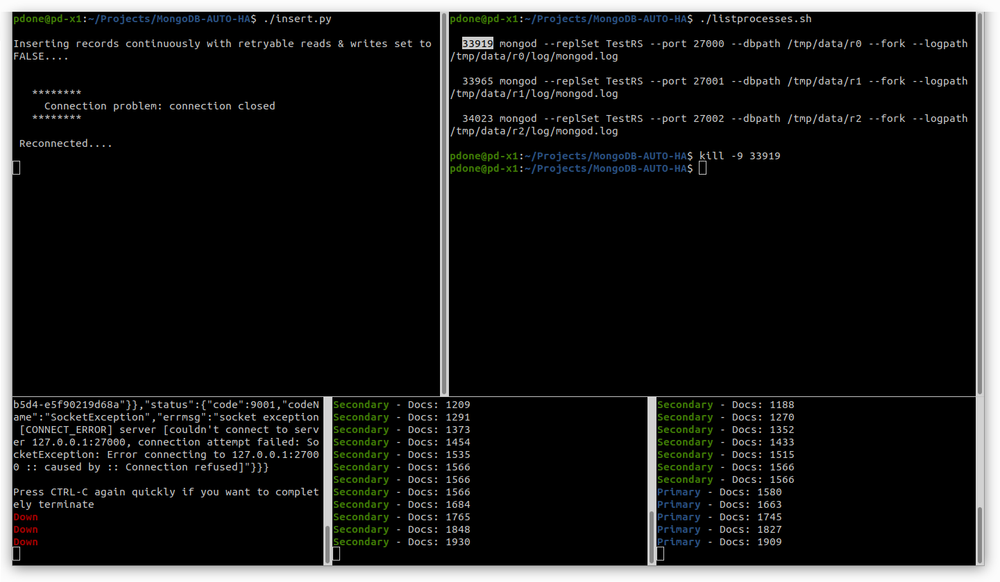

# MongoDB-AUTO-HA

Project to enable someone to easily demonstrate the fast failover and auto-healing of a MongoDB Replica Set, all run and demonstrated from a single laptop/workstation. Note: For MDB-SAs there is also a [demo video](https://drive.google.com/file/d/1qTxEb569CpIw2-6Yf61Cr66Q6dMZS-CL/).

 

## Demo Prerequisites

Ensure the following software is already installed on the laptop/workstation.

- [MongoDB database (version 3.6 or greater)](https://docs.mongodb.com/manual/installation/)
- [Python 3 interpreter](https://www.python.org/downloads/)
- [PIP Python package installer](https://pip.pypa.io/en/stable/installing/)
- [MongoDB's latest Python driver - PyMongo](https://docs.mongodb.com/drivers/pymongo/)
- [Python DNS library - dnspython](https://pypi.org/project/dnspython/)
- OPTIONAL: [Terminator multi-paned terminal](https://gnometerminator.blogspot.com/p/introduction.html) (also see the [manual](https://terminator-gtk3.readthedocs.io/))


## Demo Setup

Using the laptop/workstation's normal OS native terminal/shell, from the base directory of this project launch the Terminator multi-paned terminal application where the whole of the demo will then be executed from (this uses a specific configuration file `.terminator_config` to show Terminator with the layout structure required to best show this demo):
```bash
./terminator.sh
```

&nbsp;&nbsp;&nbsp;&nbsp;__NOTE:__ If you are using _MacOS_ and have issues using _Fink_ to install _Terminator_ then you can just use _iTerm_ instead and then layout 5 instances of _iTerm_ to roughly match the screenshot shown above (i.e. a 1st row of 2 _iTerms_ + a 2nd row of 3 _iTerms_)

## Demo Execution

1. Using the __3 bottom panes__ shown in _Terminator_ (or the _iTerms_), start 3 instances of the _monitoring_ Bash/Mongo-Shell script, one in each pane, which will check the health of the local `mongod` servers listening on ports `27000`, `27001` and `27002` respectively (__IMPORTANT__: do not change these ports as other scripts assume these specific ports are being used):
```bash
./monitor.sh 27000
./monitor.sh 27001
./monitor.sh 27002
```

&nbsp;&nbsp;&nbsp;&nbsp;_(initially these monitoring scripts will report that the `mongod` servers are down, because they have not been started yet)_

2. In the __top right__ pane, first show and explain the contents of the `start.sh` shell script which will be used to kill all existing `mongod` processes and will then start 3 `mongod` servers, each listening on different local ports, then run it:
```bash
cat start.sh
./start.sh
```

&nbsp;&nbsp;&nbsp;&nbsp;_(the 3 monitoring scripts will now report that the servers are up but not initialised as a replica set)_

3. In the __top right__ pane, clear the existing output and first show and explain the contents of the `configure.sh` shell script which will configure a replica set using the 3 running `mongod` servers, then run it:
```bash
clear
cat configure.sh
./configure.sh
```

&nbsp;&nbsp;&nbsp;&nbsp;_(the 3 monitoring scripts will now report that the servers are all now configured, with one shown as the primary and two shown as secondaries, each showing the number of records that have currently been inserted into an arbitrary database collection - currently zero)_

4. In the __top left__ pane, first show and explain the contents of the `insert.py` Python script which will insert new records into the arbitrary database collection, in the replica set, then run it:
```bash
cat insert.py
./insert.py
```

&nbsp;&nbsp;&nbsp;&nbsp;_(the 3 monitoring scripts will now report that the number of records contained in the database collections is increasing over time)_

5. In the __top right__ pane, clear the existing output and run the following script to list the 3 running `mongod` servers alongside their OS process IDs, then abruptly terminate (`kill -9`) the process corresponding to the `mongod` which is currently shown as being primary in the bottom 3 panes (replace the _12345_ argument with the real process ID):
```bash
clear
./listprocesses.py
kill -9 12345
```

&nbsp;&nbsp;&nbsp;&nbsp;_(the 3 monitoring scripts will report that one of the servers has gone down, and for the remaining 2 servers, for a second or two, both are still secondaries with no more records being inserted, and then one automatically becomes the primary and additional records are automatically inserted continuously again; also notice that in the **top left** pane the Python script reports a temporary connection problem, before carrying on its work - because retryable reads and writes have not been enabled for it)_

6. In the __top right__ pane, clear the existing output and display the content of `start.sh` shell script and then copy the one line, corresponding to the killed `mongod` server, then paste and execute the copied command into the same pane terminal, to restart the _failed_ `mongod` server (the example below shows the command line for starting the first of the 3 `mongod` servers, which you may need to change if it was one of the other 2 servers which had been killed):
```bash
clear
cat start.sh
mongod --replSet TestRS --port 27000 --dbpath /tmp/data/r0 --fork --logpath /tmp/data/r0/log/mongod.log
```

&nbsp;&nbsp;&nbsp;&nbsp;_(the 3 monitoring scripts will now report that all 3 servers are happily running and the recovered server, shown now as a secondary, is catching up on the records it missed when it was down)_

7. In the __top left__ pane, stop the Python running script and then re-start it again with the argument `retry` passed to it, to instruct the PyMongo driver to now enable retryable reads & writes, to further insulate the client application from the short failover window that occurs when a primary goes down:

```bash
# Type CTRL-C / CMD-C
clear
./insert.py retry
```

&nbsp;&nbsp;&nbsp;&nbsp;_(notice that the output of this Python script now shows that retryable reads & writes are set to TRUE)_

8. In the __top right__ pane, clear the existing output and list the `mongod` server process IDs again, then terminate the one currently shown as primary (replace the _12345_ argument with the real process ID):
```bash
clear
./listprocesses.py
kill -9 12345
```

&nbsp;&nbsp;&nbsp;&nbsp;_(this time, in the **top left** pane, the Python script will not report any connection problems when the failover occurs - notice the running monitoring scripts in the bottom 3 panes will show a stall in increasing number of inserted records, for a second or two, before increasing again when one of the two remaining `mongod` servers automatically becomes the primary)_

&nbsp;

# Credits / Thanks

* __Eugene Bogaart__ for coming up with the original server health detection and colour coding mechanism which I then adapted further in `monitor.sh`
* __Jim Blackhurst__ for the original suggestion to use _Terminator_ for displaying the 5 required 'views'
* __Jake McInteer__ for testing on MacOS + finding and reporting some bugs

